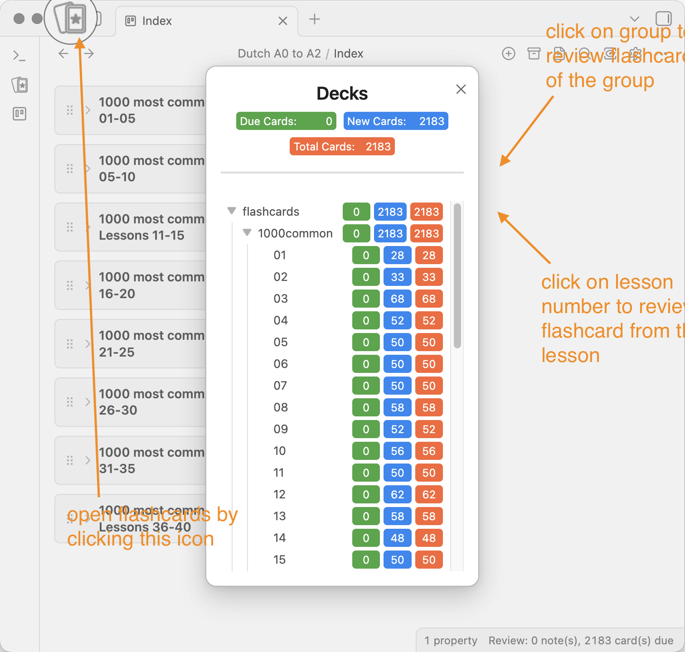
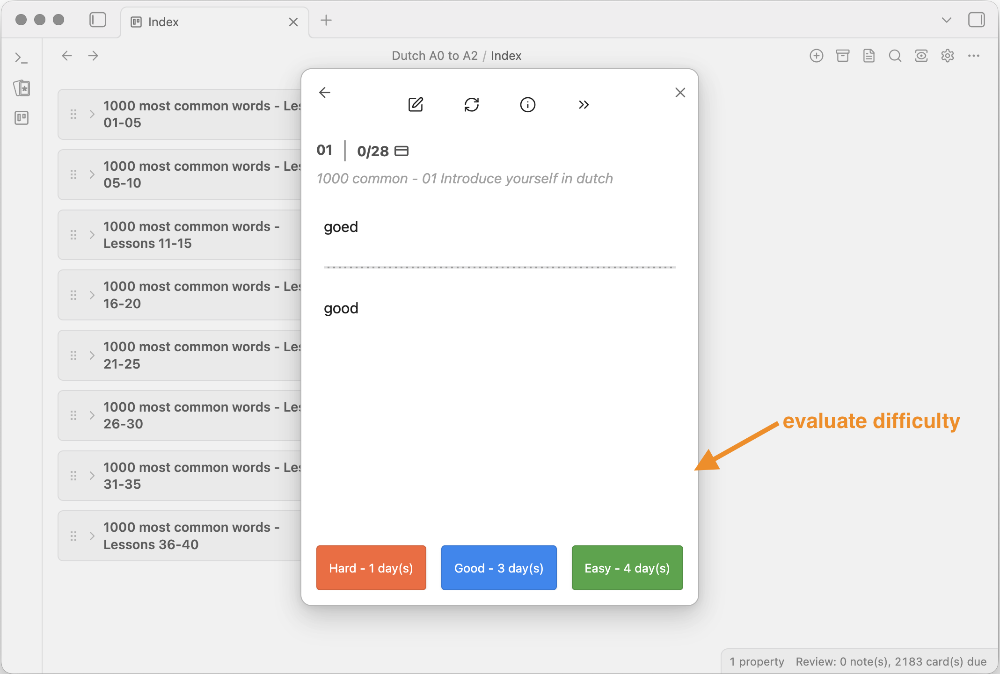

The idea of this small repository was to have a good way to review new words.

The flashcards can be accessed via the icon on the right side.
- clicking on a single lesson (e.g. `01`) will access only cards from that lesson
- clicking on the entire deck (e.g. `1000common`) will create a session from the entire set of cards

You will get a question and see the answer after clicking the `Show Answer` button. Then you can evaluate how difficult it was for you, so the algorithm can choose which cards are shown in future sessions. 

