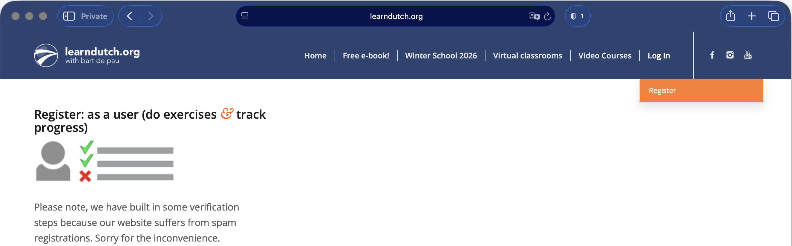
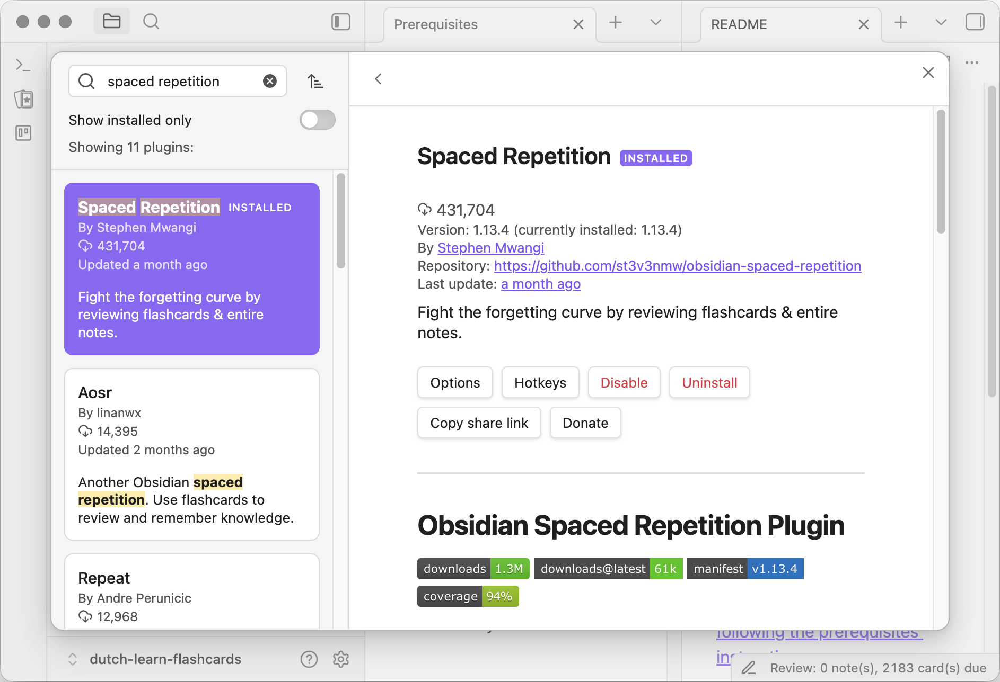
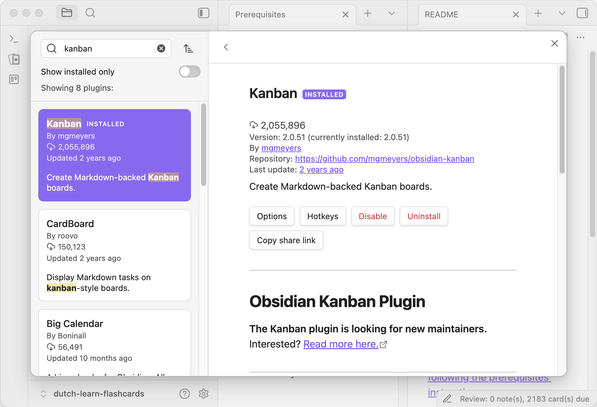

# 1. learndutch.org account

The website is a fantastic resource, and it can be used without an account. However, it can help you track your progress and discover even more resources.

Click on `Log in` in the main menu, then on `Register`. Follow the instructions.

# 2. Obsidian

Obsidian is a **free tool** for note-taking, that is greatly customisable via plugins. You can use it without paying anything on your desktop/laptop/mobile. By default it does not synchronise files between devices. If you want that, you can either pay for Obsidian's [Sync paid service](https://obsidian.md/sync), or [find a free plugin](https://obsidian.md/plugins?search=sync) and set it up yourself.

We will use an extremely minimal setup. Only a couple of plugins to get started!

## 2.1 Download Obsidian

- Go to [the Obsidian website](https://obsidian.md)
- Then to the [Download](https://obsidian.md/download) page
- Install the application for your operating system

## 2.2 Install Spaced Repetition plugin

## 2.3 Install Kanban plugin

