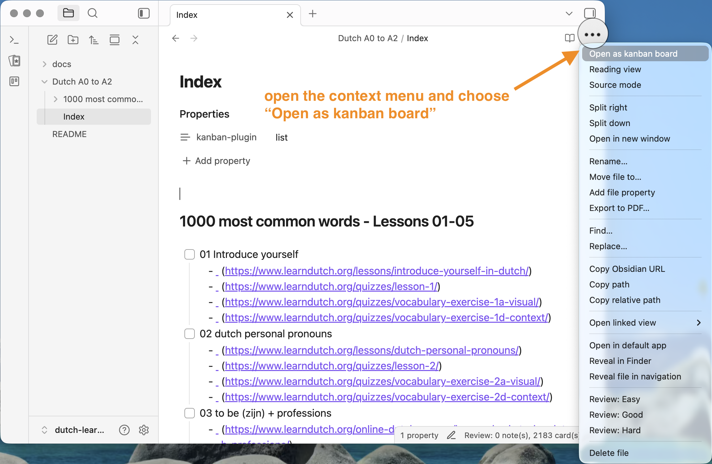
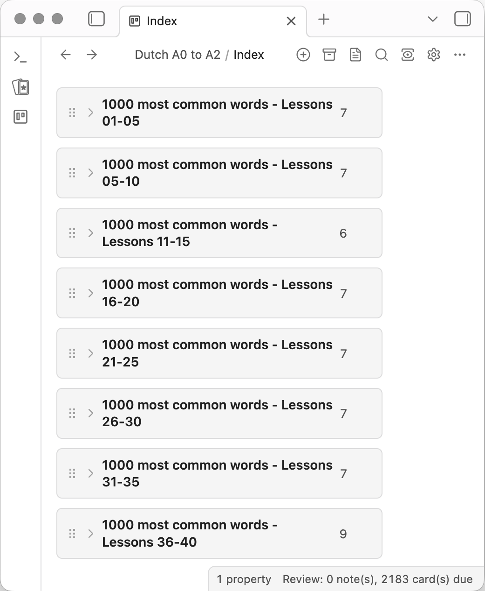
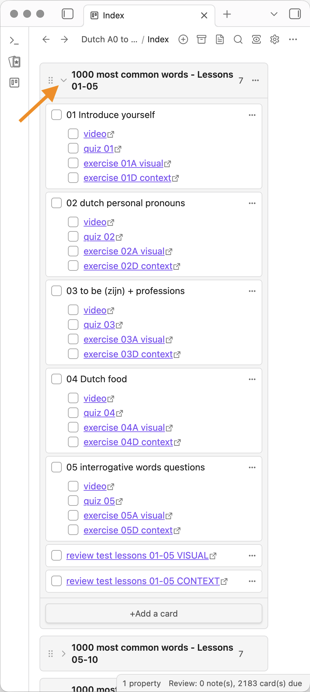

Open the Index tasks page from the list of files. Then open it as a kanban board, as illustrated below.

It will show you groups of 5 lessons from Bart de Pau's 1000 most common words excellent series.

Get ready for the first lesson! Expand the first group and check the video, then do the exercises one by one. Don't forget to mark the task as done, to mark your progress!

